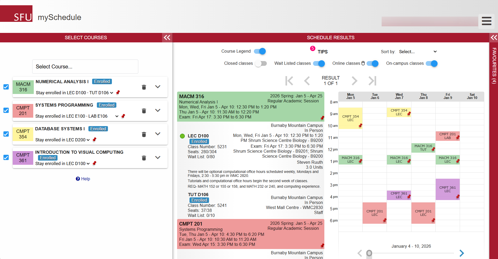

  

<h1 align="center">PickMyProf</h1>

  Helping SFU students choose better courses with section-based professor insights.

  <a href="https://github.com/PickMyProf">Main Repository</a>

---

## Table of Contents

- [Overview](#overview)
- [Inspiration](#inspiration)
- [Mission](#mission)
- [The Problem](#the-problem)
- [Our Approach](#our-approach)
- [What PickMyProf Offers](#what-pickmyprof-offers)
- [Tech Stack](#tech-stack)
- [Development Status](#development-status)
- [Team](#team)
- [Contact](#contact)

---

## Overview

PickMyProf is an SFU-focused course decision platform that combines the planning utility of a scheduler with the depth of professor and section insights.

  

Instead of forcing students to switch between timetable tools and scattered review platforms, PickMyProf brings everything into one workflow — helping students compare sections based on:

- **schedule fit**
- **instructor quality**
- **historical section trends**
- **student feedback**
- **workload expectations**

Our goal is simple: help students make smarter enrollment decisions with more confidence.

---

## Inspiration

PickMyProf is inspired by two tools that many students already know and use:

- **Rate My Professor** for giving students access to professor-based feedback and teaching insights
- **SFU Scheduler / MySchedule** for helping students visualize and organize their course schedules

Our goal is to bring the strengths of both experiences into one student-focused platform: a place where students can not only see **when** a course fits into their schedule, but also understand **how that section may actually feel to take**.

  
  

> PickMyProf is an independent student project and is not affiliated with or endorsed by SFU, SFU Scheduler, or Rate My Professor.

---

## Mission

To make course selection at SFU more transparent, data-informed, and student-friendly by combining scheduling context with structured professor and section insights.

---

## The Problem

Course selection is often more frustrating than it should be.

Students usually have to juggle multiple disconnected tools and incomplete information:

- Timetable tools show **when** a class fits, but not whether it is a good section
- Review platforms focus on professors, but often lack **section-level context**
- Students cannot easily compare different sections of the same course in one place
- Workload, fairness, clarity, and course experience are often discovered **too late**
- Important feedback is scattered across Reddit, friends, Discord messages, and outdated review pages

This makes course planning slower, more stressful, and less reliable.

---

## Our Approach

PickMyProf brings scheduling and teaching insights together into one clean experience.

### We focus on:

- **Section-first decision making**  
  Students choose between actual section offerings, not just course codes.

- **Integrated planning**  
  Scheduling details and professor insights appear side by side.

- **Structured student feedback**  
  Reviews include overall ratings, dimension-based scores, tags, and optional comments.

- **Historical visibility**  
  Students can compare how sections and instructors perform across terms.

- **Cleaner decision support**  
  Search, filters, and analytics help students narrow down the best options faster.

---

## What PickMyProf Offers

### Course and Section Discovery
- Browse offerings by **term, department, and course**
- View section details such as:
  - class times
  - instructor
  - delivery mode

### Integrated Selection View
- Compare multiple sections of the same course
- See timetable fit and teaching insights in one place

### Professor and Section Insights
- Overall rating summaries
- Criterion-based ratings such as:
  - clarity
  - fairness
  - workload
  - support
- Historical trends across terms

### Student Reviews
- One review per completed section
- Optional written comments
- Tags for quick insight, such as:
  - exam-heavy
  - organized
  - fast-paced

### Search and Filtering
- Search by:
  - professor name
  - course code
  - department
- Filter by:
  - term
  - rating threshold
  - workload level
  - delivery type

### Analytics and Visualization
- Average ratings
- Tag frequency
- Rating distributions
- Term-over-term trends

### Moderation and Data Quality
- Review moderation workflow
- Visibility control for inappropriate or spam content

---

## Tech Stack

PickMyProf is being built with the following stack:

- **Database:** MySQL
- **Backend:** Python, FastAPI
- **Frontend:** React, HTML, CSS, JavaScript
- **UI:** ShadCN UI, React
- **Version Control:** Git + GitHub

The platform also plans to integrate official SFU course and section metadata from publicly available outlines sources, while storing review and rating data internally for querying and analysis.

---

## Development Status

**Current Phase:** 🚧 Early Development / Database + Platform Design

We are currently building PickMyProf, including the relational schema, core application structure, and the first version of the student-facing experience.

Planned priorities include:

- core course and section browsing
- professor/section rating views
- student review flows
- filtering and search
- analytics and moderation tools

---

## Team

Built by the PickMyProf team:

- **Alexander Potiagalov**
- **Khalid Karim**
- **Yusuf Shalaby**
- **Mohamed Refaai**

---

## Contact

**Organization:** PickMyProf  
**Focus:** SFU course planning + professor insights

---

  Built for students who want more than just a timetable.

